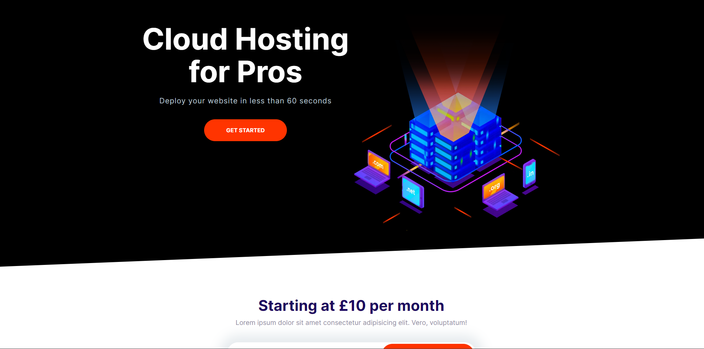

## Table of contents

- [Overview](#overview)
- [The challenge](#the-challenge)
- [Screenshot](#screenshot)
- [Links](#links)
- [My process](#my-process)
- [Built with](#built-with)
- [What I learned](#what-i-learned)
- [Useful resources](#useful-resources)

## Overview

In this project was build a cloud hosting website.

### The challenge

The website is fully responsive build with mobile first in mind and is apply Object Oriented CSS and BEM (Block Element Modifier).

### Screenshot

# Click the link below for live view

- (https://miron-silviu.github.io/Easyhost/)

## My process

The process for building the website is made of many other subprocess. For example in every section each process is
build in isolation and at the end was put all together.

## Built with

- Semantic HTML5 markup
- CSS custom properties
- Flexbox
- CSS Grid
- Mobile-first workflow

## What I learned

Building this website form 0 to finish I was able to learn more about input fields also how and when to use media queries, transition property.
I learn how to use variables in css. The most important concept was Object Oriented Css and BEM (Block Element Modifier).

## Useful resources

- (https://oge.me) - This helped me to create links for metadata . I really liked this pattern and will use it going forward.
- (https://bennettfeely.com/clippy/) - This is an amazing article which helped me finally understand clipping. I'd recommend it to anyone still learning this concept.
